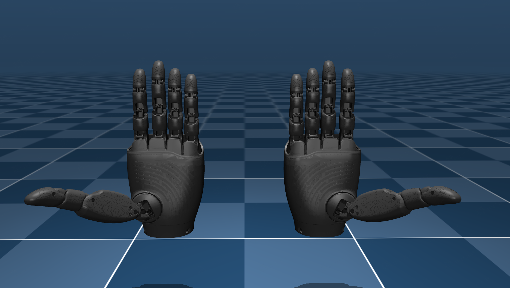

# 智元灵巧手 OmniHand 专业款 2025 安装并连接到电脑进行开发和控制时遇到的问题及总结
在将智元灵巧手 OmniHand 专业款 2025 安装并连接到电脑进行开发和控制时遇到的问题及总结：
要将 智元灵巧手 OmniHand 专业款 2025 安装并连接到电脑进行开发和控制，根据你提供的截图和官方文档信息，你主要需要下载以下四大类资源：
本实验使用的是基于Linux的ros2系统，需要下载的为  SDK、URDF与说明文档中的URDF（上传日期：2026.2.1）：OmniHand Pro 2025 URDF。文档的开源链接：https://www.zhiyuan-robot.com/DOCS/OS/Omnihand-O12


①：着重分享：根据压缩文件包内的所有步骤在最后显示右手模型的部分指令为：

ros2 launch omnihand_pro_description omnihand_pro_description_launch.py
但是系统生成的py文件应当是

ros2 launch omnihand_pro_description omnihand_pro_description.launch.py
文件名的不同可能导致无法运行等问题！！！


②：分享如何实现灵巧手在rviz中围绕坐标轴原点360°旋转。
第一步：在工作空间创建新功能包
1.我们需要一个专门存放你脚本的地方。打开终端，进入你的 src 目录：

cd ~/omnihand_pro_ws/src

2.创建一个 Python 类型的 ROS 2 功能包：

ros2 pkg create --build-type ament_python hand_controller --dependencies rclpy tf2_ros geometry_msgs

第二步：编写控制脚本

我们将创建一个名为 hand_mover.py 的文件，让手在空中做圆周运动。

cd hand_controller/hand_controller

使用你喜欢的编辑器（如 gedit 或 code）创建并打开文件：

gedit hand_mover.py


复制此代码进入py文件


import rclpy

from rclpy.node import Node

from tf2_ros import TransformBroadcaster

from geometry_msgs.msg import TransformStamped

import math

class HandMover(Node):

    def __init__(self):
        super().__init__('hand_mover_node')
        self.br = TransformBroadcaster(self)
        # 设置定时器，每 0.05 秒更新一次位置 (20Hz)
        self.timer = self.create_timer(0.05, self.broadcast_timer_callback)
        self.angle = 0.0

    def broadcast_timer_callback(self):
        t = TransformStamped()
        
        # 1. 设置时间戳和坐标系名称
        t.header.stamp = self.get_clock().now().to_msg()
        t.header.frame_id = 'world'      # 父坐标系：世界
        t.child_frame_id = 'base_link'   # 子坐标系：灵巧手的根部

        # 2. 计算圆周运动轨迹
        radius = 0.5  # 半径 0.5 米
        self.angle += 0.05
        t.transform.translation.x = radius * math.cos(self.angle)
        t.transform.translation.y = radius * math.sin(self.angle)
        t.transform.translation.z = 0.2 # 离地 0.2 米

        # 3. 设置姿态（这里保持不旋转，设为单位四元数）
        t.transform.rotation.x = 0.0
        t.transform.rotation.y = 0.0
        t.transform.rotation.z = 0.0
        t.transform.rotation.w = 1.0

        # 4. 发送坐标变换
        self.br.sendTransform(t)

def main():
    rclpy.init()
    node = HandMover()
    try:
        rclpy.spin(node)
    except KeyboardInterrupt:
        pass
    rclpy.shutdown()

if __name__ == '__main__':
    main()


第三步：配置安装信息
打开 setup.py：

cd ~/omnihand_pro_ws/src/hand_controller

gedit setup.py

在 entry_points 的 'console_scripts': [ 这一行后面，添加如下内容：

'hand_mover = hand_controller.hand_mover:main',//(新文件中已添加)

第四步：编译并运行
回到工作空间根目录进行编译：

cd ~/omnihand_pro_ws

colcon build --packages-select hand_controller

source install/setup.bash

**启动你的灵巧手 RViz**

ros2 launch omnihand_pro_description omnihand_pro_description.launch.py

在另一个新终端启动脚本：

source ~/omnihand_pro_ws/install/setup.bash

ros2 run hand_controller hand_mover

第五步：在 RViz 中见证奇迹
回到 RViz 窗口。
将左侧 Global Options 里的 Fixed Frame 改为 world。
你会发现这只手现在开始在 3D 空间中绕着中心点顺滑地转圈了！


1. 软件环境与工具（必选）
上位机软件：
下载项：图中显示的 OmniHand_Pro_2026_02_26。
用途：这是最直观的图形化界面工具，用于初步测试手部的关节运动、传感器反馈和状态监控。

SDK（开发工具包）：
下载地址：图中提供的 GitHub 链接 https://github.com/AgibotTech/OmniHand-Pro-2025。
用途：如果你需要编写代码控制灵巧手（支持 Python 和 C++），必须下载此 SDK。它包含了驱动接口和 API 文档。

2. 系统与硬件驱动（环境准备）
操作系统建议：官方 SDK 通常针对 Ubuntu 22.04 系统优化，如果你在 Windows 下使用，可能需要通过虚拟机或 WSL，或者仅使用上位机进行简单控制。
CAN驱动：由于该款灵巧手通常使用 CANFD 接口通信，你需要根据你使用的 CAN 转 USB 模块（如周立功 ZLG）去官网下载对应的硬件驱动。

3. 文档与模型（参考用）
维护指导手册 / 说明书：

下载项：OmniHand 专业款 2025 灵巧手 维护手册。
用途：了解接线定义、电源要求（通常需要外部供电）以及拆装注意事项，防止误操作烧毁电路。
下载项：OmniHand Pro 2025 URDF 或 OmniHand 专业款 2025 模型。
用途：如果你要在仿真环境（如 ROS、Gazebo、Isaac Gym）中使用这只手，必须下载这些模型文件。

4. 固件（根据需要）
固件更新包：
下载项：图中显示的 1-12-15。
注意：除非你发现手部功能有 Bug 或官方提示升级，否则不要随意刷写固件，以免导致设备无法启动。
建议安装步骤：
先下文档：仔细阅读《产品使用说明书》，确认电压和接线。
装上位机：在电脑上安装上位机软件，配合 CAN 卡驱动，尝试连接并让手动起来。
配置 SDK：如果要二次开发，去 GitHub 克隆代码并按照 README 文档配置编译环境。


按照以下条件正常操作即可安装至Linux系统中！！！


# OmniHandPro ROS 2 软件包

这是一个用于 **OmniHandPro** 的 ROS 2 软件包，包含左右手的 URDF 模型文件，并支持在 RViz 中可视化显示。推荐使用的 ROS 2 版本为 **Humble**。

## 安装指南

### 1. 克隆仓库

创建工作空间并克隆仓库：

```bash
mkdir -p ~/omnihand_pro_ws/src
cd ~/omnihand_pro_ws/src
git clone <repository_url>
cd ..
```

### 2. 编译工作空间

运行以下命令进行编译：

```bash
colcon build
```

### 3. 加载环境

在使用前，需要加载工作空间的环境配置：

```bash
source install/setup.bash
```

## 生成 OmniHandPro 的 URDF 文件

通过 Xacro 文件生成 URDF：

```bash
cd ~/omnihand_pro_ws/src/omnihand_pro_description/assets/urdf/xacro
xacro omnihand_pro_right.xacro > omnihand_pro_right.urdf
xacro omnihand_pro_left.xacro > omnihand_pro_left.urdf
```

## RViz 可视化

### 显示右手模型
```bash
ros2 launch omnihand_pro_description omnihand_pro_description_launch.py
```

### 显示左手模型
```bash
ros2 launch omnihand_pro_description omnihand_pro_description_launch.py hand_type:=left
```

## 更加精确的碰撞 URDF 模型
本包额外提供基于原始 mesh 进行 凸分解优化 的碰撞模型 URDF，用于实现更真实、更精确的物理接触效果。
相比常规基于 box/sphere 的碰撞建模，该模型可显著提高碰撞检测的准确性。

高精度碰撞模型位于：
omnihand_pro_description/assets/urdf_mesh_col/

### 显示右手（精确碰撞模型）
```bash
ros2 launch omnihand_pro_description omnihand_pro_description_col.launch.py
```

### 显示左手（精确碰撞模型）
```bash
ros2 launch omnihand_pro_description omnihand_pro_description_col.launch.py hand_type:=left
```

> **关于关节耦合精度的说明**\
> URDF 仅支持 **线性耦合**，而 OmniHandPro
> 的大部分被动关节与主动关节之间是 **非线性耦合**。\
> 因此，URDF 模型无法完全复现真实机械手的耦合行为。\
> 若需要模拟真实耦合关系，请参考：
> - **MuJoCo 的 MJCF 模型**（已包含真实非线性映射）
> - **OmniHandPro SDK**（计算真实耦合关系）

------------------------------------------------------------------------

## MuJoCo MJCF 文件

本包也提供 **MuJoCo MJCF 模型**，可用于在物理仿真环境中模拟 OmniHandPro。  
MJCF 文件兼容 **MuJoCo 3.1.0 及以上版本**。

模型路径：

```
omnihand_pro_description/assets/MJCF/
```

包含以下内容：

- `scene.xml` – 完整场景文件，可快速预览  
- `omnihand_pro_left.xml` – 左手 MJCF 模型  
- `omnihand_pro_right.xml` – 右手 MJCF 模型  
- `meshes/` – 对应的 STL 网格文件  

### 快速预览方式

1. 打开 MuJoCo 自带的 `simulate` 查看器  
2. 将 `assets/MJCF/scene.xml` 拖入窗口  
3. 模型会自动加载并显示  

示例：


